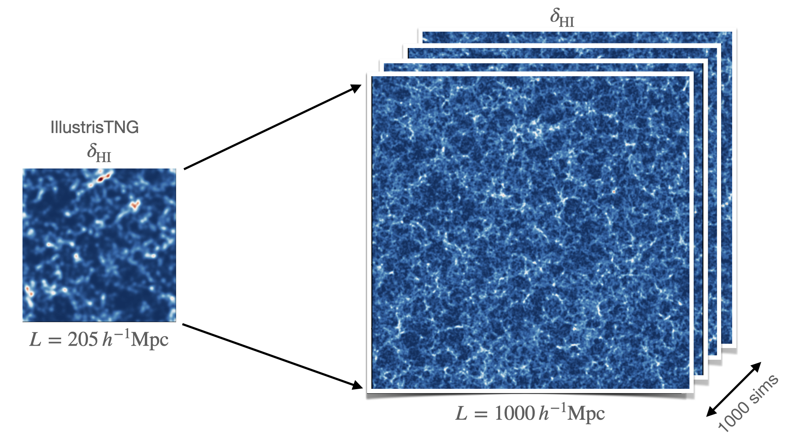

# Hi-Fi mocks

Codes to generate fast HI field-level (Hi-Fi) mocks in real and redshift space.

 

    

## About

Codes to produce 3D neutral hydrogen (HI) over-density fields in real and redshift space tuned to HI clustering properties of [Illustris](https://www.tng-project.org) TNG300-1 (L=205 Mpc/h). These codes allow quick and accurate production of HI mocks for any box size and any redshift between z=0-5. This code is accompanying the paper: [arXiv:2207.12398](https://arxiv.org/abs/2207.12398)/[PRD](https://doi.org/10.1103/PhysRevD.108.083528). It is based on the perturbative approach from [Schmittfull+18](https://arxiv.org/abs/1811.10640) & [+19](https://arxiv.org/abs/2012.03334).

## Installation

`Hi-Fi mocks` are based on and require [nbodykit](https://github.com/bccp/nbodykit) package. To install `nbodykit` please follow these [instructions](https://nbodykit.readthedocs.io/en/latest/getting-started/install.html) (preferably using `conda`). Once installed, also install `matplotlib` package by running: `conda install matplotlib` within the `nbodykit` conda environment.

After succesfully installing `nbodykit` and `matplotlib`, download `Hi-Fi mocks` code. This can be done for example via terminal using:

`git clone https://github.com/andrejobuljen/Hi-Fi_mocks.git`

Then enter the folder `Hi-fi_mocks` and follow the next steps. In order to use this code from outside its folder, add `Hi-Fi mocks` folder to your `PYTHONPATH` by running in terminal: `export PYTHONPATH=/path/to/HI-Fi_mocks:$PYTHONPATH`.

## Usage

To generate HI mock in real space run the following:

``python Hi-Fi_mock_real_space.py``

To generate HI mock in redshift space run the following:

``python Hi-Fi_mock_redshift_space.py``

The parameters for each run are the following:
 - `BoxSize`, size of the box in units of Mpc/h,
 - `Nmesh`, number of mesh grids per side,
 - `seed`, initial condition (IC) seed number,
 - `zout` output redshift between z=0-5,
 - `output_folder`, name of the output folder where the fields and power spectra are to be stored.
 
These parameters can be specified while running codes in the following way:

``python Hi-Fi_mock_real_space.py --seed=seed --nmesh=Nmesh --boxsize=BoxSize --output_redshift=zout --output_folder='output_folder'``

``python Hi-Fi_mock_redshift_space.py --seed=seed --nmesh=Nmesh --boxsize=BoxSize --output_redshift=zout --output_folder='output_folder'``

The default values of run parameters are set to those of TNG300-1 (`BoxSize=205 Mpc/h`, `Nmesh=256^3`, `seed=2695896`), and (`zout=1`).  

Based on these given parameters these codes produce HI meshes in real & redshift space using best-fit polynomials for transfer functions tuned to scales in the k range of TNG300-1: 0.03-1 h/Mpc. The transfer function fits are calibrated to the following TNG300-1 output redshifts z=[0,0.5,1,1.5,2,3,5]. The code interpolates transfer functions for other `zout` values.

For default parameters it takes less than 2 minutes on a modern laptop for the codes to finish, and output final HI overdensity field, figure with smoothed overdensity slice and measured power spectra into the `output_folder`. Note that for larger box sizes a higher grid resolution is needed in order to probe small scales, which makes the code run slower and requires more memory. 

### Running the codes in parallel

To run `Hi-Fi mocks` in parallel using `N` processors, run the codes in a following way:

``srun -n N python Hi-Fi_mock_real_space.py``

and 

``srun -n N python Hi-Fi_mock_redshift_space.py``. 

### References

If you use `Hi-Fi mocks` for your research, please cite:
> Obuljen et al., *Modeling HI at the field level*, [Phys.Rev.D 108 (2023) 8](https://doi.org/10.1103/PhysRevD.108.083528), arXiv:[2207.12398](https://arxiv.org/abs/2207.12398)
and `nbodykit` paper:
> Hand et al., *nbodykit: an open-source, massively parallel toolkit for large-scale structure*, [Astron. J., 156, 160 (2018)](https://dx.doi.org/10.3847/1538-3881/aadae0), arXiv:[1712.05834](https://arxiv.org/abs/1712.05834).

### Author
- [Andrej Obuljen](mailto:andrej.obuljen@uzh.ch) (ICS, Zurich)

### Acknowledgement
Parts of our code uses scripts from [lsstools](https://github.com/mschmittfull/lsstools) and parts are based on [perr](https://github.com/mschmittfull/perr).
